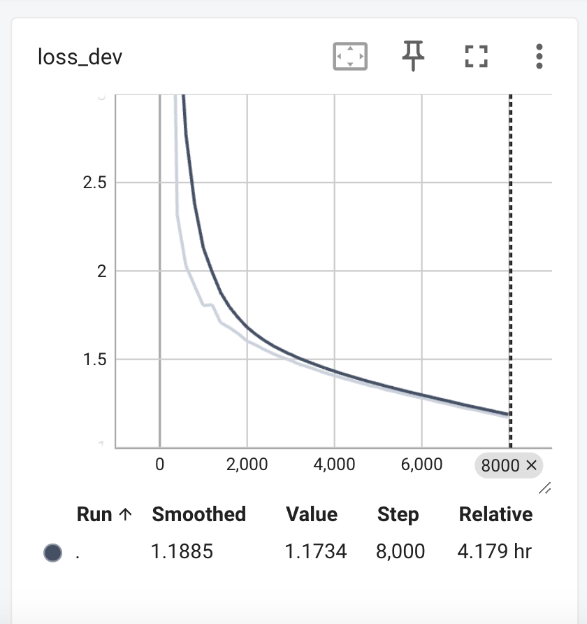
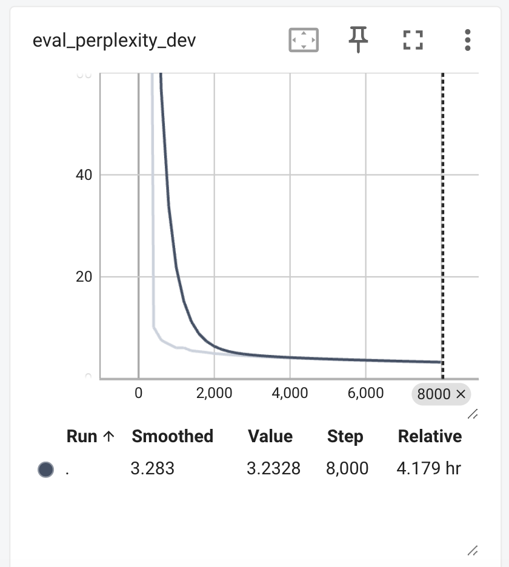

# Python Next Token

## Requirements installation
1) cd python_next_token
2) pip install -r requirements.txt

## Data Preparation
1) python convert.py --segment_len 256 --stride 10 --dev_size 0.1
This will create a directory dataset/source_code/json where the train and val data will be stored.
2) For the purposes of this assignment I used 50% of the data found at: https://huggingface.co/datasets/ArtifactAI/arxiv_python_research_code

## Finetune Model
python train.py [all the arguments have default, take a look at train.py to see which arguments you want to change]
The model checkpoint will be stored at stored_model/0_GPTSingleHead

# Test the Model
python predict.py --model_path stored_model/0_GPTSingleHead

- instructions to install requirements to use your project
- instructions to train your model
- instructions to use your model to perform inference on a Python snippet
- plots of relevant metrics/values over the course of your training procedure
- credits to the different repositories or resources that you used for your implementation
- those previous elements should be included along with an explanation of your approach in a small report in markdown format saved as `README.md`.
- your trained model checkpoint as a [hub model on HuggingFace](https://huggingface.co/docs/hub/en/models-uploading).
